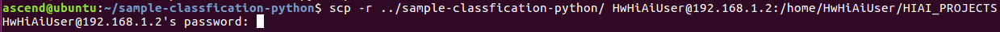

# 语义分割网络应用（Python）<a name="ZH-CN_TOPIC_0219036254"></a>

本应用支持运行在Atlas200DK上，实现了erfnet网络的推理功能并输出根据语义分割着色的图片。

## 前提条件<a name="section137245294533"></a>

部署此Sample前，需要准备好以下环境：

-   已完成Mind Studio的安装。

-   已完成Atlas 200 DK开发者板与Mind Studio的连接，SD卡的制作、编译环境的配置等。
-   由于需要配置开发板联网，默认设置为USB连接，开发板地址为192.168.1.2

## 部署<a name="zh-cn_topic_0203223294_section081240125311"></a>

1.  部署，可以选择如下快速部署或者常规方法部署，二选一即可；

    1.1 快速部署，请参考：https://gitee.com/Atlas200DK/faster-deploy 。

    > **说明：**   
    >-   该快速部署脚本可以快速部署多个案例，请选择segmentation案例部署即可。  
    >-   该快速部署脚本自动完成了代码下载、模型转换、环境变量配置等流程，如果需要了解详细的部署过程请选择常规部署方式，请转**1.2 常规部署**。

    1.2 常规部署，请参考：https://gitee.com/Atlas200DK/sample-README/tree/master/sample-segmentation 。

    > **说明：**   
    >-   该部署方式，需要手动完成代码下载、模型转换、环境变量配置等过程。完成后，会对其中的过程会更加了解。


## 环境部署<a name="section1759513564117"></a>

1.  应用代码拷贝到开发板。

    以Mind Studio安装用户进入语义分割网络应用\(python\)代码所在根目录，如：$HOME/sample-segmentation-python，执行以下命令将应用代码拷贝到开发板。

    **scp -r ../sample-segmentation-python/ HwHiAiUser@192.168.1.2:/home/HwHiAiUser/HIAI\_PROJECTS**

    提示password时输入开发板密码，开发板默认密码为**Mind@123**，如[图 应用代码拷贝](#fig1660453512014)。

    **图 1** **应用代码拷贝**<a name="fig1660453512014"></a>  
    

    

2.  配置开发板联网。
    1.  不断开usb连接的情况下，开发板通过网线与可以上网的网口相连。
    2.  在Mind Studio所在Ubuntu服务器中，以HwHiAiUser用户SSH登录到Host侧。

        **ssh HwHiAiUser@192.168.1.2**

        切换到root用户，开发板中root用户默认密码为**Mind@123**。

        **su root**

        打开interfaces配置文件。

        **vim /etc/network/interfaces**

        配置dhcp，把eth0的配置修改为如下两行。

        **auto eth0**

        **iface eth0 inet dhcp**

        如[图 开发板interface文件配置](#fig151021334153812)所示，输入:wq!保存退出。

        **图 2**  开发板interface文件配置<a name="fig151021334153812"></a>  
        

    3.  执行以下命令重启开发板，使配置生效。

        **reboot**

    4.  等开发板四个灯常亮时则证明已经完成重启，此时可以ping外网验证网络是否通畅，如果ping通则已经配置成功；如果ping失败，则执行以下命令。成功后如[图 开发板联网配置成功](#fig4366141165015)所示。

        **ifdown eth0**

        **ifup eth0**

        **图 3**  开发板联网配置成功<a name="fig4366141165015"></a>  
        

3.  安装环境依赖。
    1.  在开发板的root用户下更换源。

        **vim /etc/apt/sources.list**

        把原有源更换为arm源，可用的国内arm源有中科大源和清华源等。

        > **说明：**   
        >arm源可参考[https://bbs.huaweicloud.com/forum/thread-37023-1-1.html](https://bbs.huaweicloud.com/forum/thread-37023-1-1.html)  

        源更新后，执行以下命令更新软件列表。

        **apt-get update**

    2.  安装相关依赖。

        ```
        apt-get install python-setuptools python-dev build-essential python-pip
        ```

        ```
        pip install numpy==1.11.2 enum34==1.1.6 future==0.17.1 funcsigs==1.0.2 enum future unique enum34 funcsigs protobuf
        ```

        > **说明：**   
        >pip install安装有报错“SSLError”时，请使用：pip install --trusted-host pypi.org --trusted-host files.pythonhosted.org numpy==1.11.2 enum34==1.1.6 future==0.17.1 funcsigs==1.0.2 enum future unique enum34 funcsigs protobuf 安装依赖，表示可信赖的主机解决问题。  

    3.  安装hiai。

        执行脚本安装hiai，hiai的安装脚本在代码路径下的scripts文件夹下。

        **cd /home/HwHiAiUser/HIAI\_PROJECTS/sample-classfiyResnet18-python/scripts**

        **bash python2\_hiai\_install.sh**

        安装后如[图 hiai安装成功验证](#fig89761216122414)所示，则为安装成功。

        **图 4**  hiai安装成功验证<a name="fig89761216122414"></a>  
        

4.  安装opencv。

    root用户下安装opencv Python库。

    命令示例：

    **apt-get install python-opencv**

    安装后如[图 opencv安装成功验证](#fig1478418313328)所示，则为安装成功。

    **图 5**  opencv安装成功验证<a name="fig1478418313328"></a>  
    


## 程序运行<a name="section6245151616426"></a>

1.  切换HwHiAiUser用户，并进入语义分割网络应用代码所在目录。

    **su HwHiAiUser**

    **cd \~/HIAI\_PROJECTS/sample-segmentation-python/segmentationapp**

2.  执行应用程序。

    执行**segmentation.py**脚本会将推理结果在执行终端直接打印显示。

    命令示例如下所示：

    **python segmentation.py**

    执行成功后效果如[图 推理成功示意图](#fig1863053617417)所示。

    **图 6**  推理成功示意图<a name="fig1863053617417"></a>  
    

    

3.  执行结果查看。

    执行结果保存在当前目录下的Result目录下，需要在Ubuntu服务器中用以下命令将结果拷贝到Ubuntu服务器中查看推理结果图片。

    scp -r _username@host\_ip_:/home/_username_/HIAI\_PROJECTS/sample-segmentation-python/Result ~

    -   username：开发板用户名，默认为HwHiAiUser。
    -   host\_ip：开发板ip，USB连接一般为192.168.1.2.网线连接时一般为192.168.0.2

    **命令示例：**

    scp -r HwHiAiUser@192.168.1.2:/home/HwHiAiUser/HIAI\\_PROJECTS/sample-segmentation-python/Result ~

    该命令会把推理结果拷贝到Mindstudio安装用户的家目录中，可以直接查看。


## 相关说明<a name="section1092612277429"></a>

-   **语义分割网络应用（Python）的流程说明如下**：
    1.  从cityimage目录下读取jpeg图片。
    2.  将读取的jpeg图片调用opencv resize到1024\*512，并转换成YUV420SP。
    3.  将转换后的YUV420SP图片数据送入Matrix进行推理。demo采用的是erfnet网络，推理结果是每个像素点的19个分类的置信度
    4.  后处理阶段，每个像素点选取最高分类置信度，在图片上对同种分类进行涂色。涂色后图片存放在Result目录下。

-   **语义分割网络应用（Python）的文件架构说明如下**：
    -   cityimage：存放输入图片
    -   segmentation.py：主程序
    -   jpegHandler.py：jpeg图片处理，如resize、色域转换等
    -   models：存放模型网络
    -   Result：存放推理后的图片


