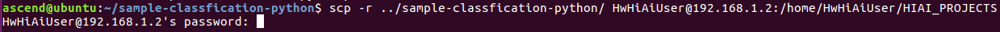
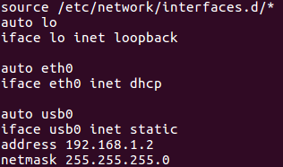
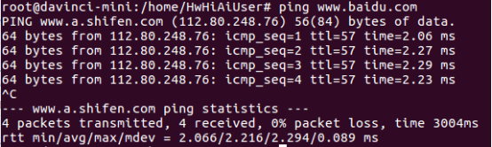
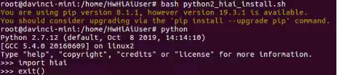
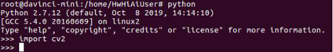
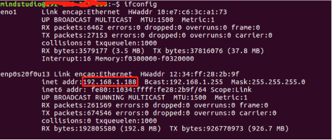

# 语义分割网络应用（Python）<a name="ZH-CN_TOPIC_0219036254"></a>

本Application支持运行在Atlas 200 DK上，实现了erfnet网络的推理功能并输出带有推理结果标签和置信度的图片。

## 前提条件<a name="section137245294533"></a>

部署此Sample前，需要准备好以下环境：

-   已完成Mind Studio的安装。

-   已完成Atlas 200 DK开发者板与Mind Studio的连接，SD卡的制作、编译环境的配置等。
-   由于需要配置开发板联网，默认设置为USB连接，开发板地址为192.168.1.2

## 软件准备<a name="section8534138124114"></a>

运行此应用前，需要按照此章节进行相关的环境配置并获取源码包。

1.  <a name="li953280133816"></a>获取源码包。

    将[https://gitee.com/Atlas200DK/sample-segmentation-python](https://gitee.com/Atlas200DK/sample-classification-python)仓中的代码以Mind Studio安装用户下载至Mind Studio所在Ubuntu服务器的任意目录，例如代码存放路径为：/home/ascend/sample-segmentation-python。

2.  获取此应用中所需要的网络模型。

    参考[表 语义分割网络应用\(python\)使用模型](#table1119094515272)获取此应用中所用到的原始网络模型及其对应的权重文件，并将其存放到Mind Studio所在Ubuntu服务器的任意目录，例如$HOME/ascend/models/sample-segmentation-python。

    **表 1**  语义分割网络应用\(python\)使用模型

    <a name="table1119094515272"></a>
    <table><thead align="left"><tr id="row677354502719"><th class="cellrowborder" valign="top" width="12.15%" id="mcps1.2.4.1.1"><p id="p167731845122717"><a name="p167731845122717"></a><a name="p167731845122717"></a>模型名称</p>
    </th>
    <th class="cellrowborder" valign="top" width="17.53%" id="mcps1.2.4.1.2"><p id="p277317459276"><a name="p277317459276"></a><a name="p277317459276"></a>模型说明</p>
    </th>
    <th class="cellrowborder" valign="top" width="70.32000000000001%" id="mcps1.2.4.1.3"><p id="p9773114512270"><a name="p9773114512270"></a><a name="p9773114512270"></a>模型下载路径</p>
    </th>
    </tr>
    </thead>
    <tbody><tr id="row3122314144215"><td class="cellrowborder" valign="top" width="12.15%" headers="mcps1.2.4.1.1 "><p id="p1910619166207"><a name="p1910619166207"></a><a name="p1910619166207"></a>erfnet</p>
    </td>
    <td class="cellrowborder" valign="top" width="17.53%" headers="mcps1.2.4.1.2 "><p id="p2010681612020"><a name="p2010681612020"></a><a name="p2010681612020"></a>图片语义分割推理模型。</p>
    <p id="p1710615162207"><a name="p1710615162207"></a><a name="p1710615162207"></a>是基于Caffe的erfnet模型。</p>
    </td>
    <td class="cellrowborder" valign="top" width="70.32000000000001%" headers="mcps1.2.4.1.3 "><p id="p910617162206"><a name="p910617162206"></a><a name="p910617162206"></a>请参考<a href="https://gitee.com/HuaweiAscend/models/tree/master/computer_vision/segmentation/erfnet" target="_blank" rel="noopener noreferrer">https://gitee.com/HuaweiAscend/models/tree/master/computer_vision/segmentation/erfnet</a>目录中README.md下载原始网络模型文件及其对应的权重文件。</p>
    </td>
    </tr>
    </tbody>
    </table>

3.  将原始网络模型转换为适配昇腾AI处理器的模型。
    1.  在Mind Studio操作界面的顶部菜单栏中选择“Tool \> Convert Model”，进入模型转换界面。
    2.  在弹出的**Convert Model**操作界面中，Model File与Weight File分别选择[步骤1](#li953280133816)中下载的模型文件和权重文件。
        -   **Model Name**填写为[表 语义分割网络应用\(python\)使用模型](#table1119094515272)中对应的**模型名称**。
        -   erfnet模型转换时中AIPP配置中的**Model Image Format**  选择BGR888\_U8，关闭MeanLess选项
        -   其他参数保持默认值。

    3.  单击OK开始转换模型。

        1.1.0.0和1.3.0.0版本模型转换成功后，后缀为.om的离线模型存放地址为**：$HOME/tools/che/model-zoo/my-model/xxx**。

        1.31.0.0及以上版本模型转换成功后，后缀为.om的离线模型存放地址为**：$HOME/modelzoo/xxx/device/xxx.om**。

    4.  将转换好的模型文件（.om文件）上传到[步骤1](#li953280133816)中源码所在路径下的“sample-segmentation-python/segmentationapp/models”目录下。


## 环境部署<a name="section1759513564117"></a>

1.  应用代码拷贝到开发板。

    以Mind Studio安装用户进入语义分割网络应用\(python\)代码所在根目录，如/home/ascend/sample-segmentation-python，执行以下命令将应用代码拷贝到开发板。

    **scp -r ../sample-segmentation-python/ HwHiAiUser@192.168.1.2:/home/HwHiAiUser/HIAI\_PROJECTS**

    提示password时输入开发板密码，开发板默认密码为**Mind@123**，如[图 应用代码拷贝](#fig1660453512014)。

    **图 1** **应用代码拷贝**<a name="fig1660453512014"></a>  
    

    

2.  配置开发板联网。
    1.  不断开usb连接的情况下，开发板通过网线与可以上网的网口相连。
    2.  在Mind Studio所在Ubuntu服务器中，以HwHiAiUser用户SSH登录到Host侧。

        **ssh HwHiAiUser@192.168.1.2**

        切换到root用户，开发板中root用户默认密码为**Mind@123**。

        **su root**

        打开interfaces配置文件。

        **vim /etc/network/interfaces**

        配置dhcp，把eth0的配置修改为如下两行。

        **auto eth0**

        **iface eth0 inet dhcp**

        如[图 开发板interface文件配置](#fig151021334153812)所示，输入:wq!保存退出。

        **图 2**  开发板interface文件配置<a name="fig151021334153812"></a>  
        

    3.  执行以下命令重启开发板，使配置生效。

        **reboot**

    4.  等开发板四个灯常亮时则证明已经完成重启，此时可以ping外网验证网络是否通畅，如果ping通则已经配置成功；如果ping失败，则执行以下命令。成功后如[图 开发板联网配置成功](#fig4366141165015)所示。

        **ifdown eth0**

        **ifup eth0**

        **图 3**  开发板联网配置成功<a name="fig4366141165015"></a>  
        

3.  安装环境依赖。
    1.  在开发板的root用户下更换源。

        **vim /etc/apt/sources.list**

        把原有源更换为arm源，可用的国内arm源有中科大源和清华源等。

        > **说明：**   
        >arm源可参考[https://bbs.huaweicloud.com/forum/thread-37023-1-1.html](https://bbs.huaweicloud.com/forum/thread-37023-1-1.html)  

        源更新后，执行以下命令更新软件列表。

        **apt-get update**

    2.  安装相关依赖。

        ```
        apt-get install python-setuptools python-dev build-essential python-pip
        ```

        ```
        pip install numpy==1.11.2 enum34==1.1.6 future==0.17.1 funcsigs==1.0.2 enum future unique enum34 funcsigs protobuf
        ```

        > **说明：**   
        >pip install安装有报错“SSLError”时，请使用：pip install --trusted-host pypi.org --trusted-host files.pythonhosted.org numpy==1.11.2 enum34==1.1.6 future==0.17.1 funcsigs==1.0.2 enum future unique enum34 funcsigs protobuf 安装依赖，表示可信赖的主机解决问题。  

    3.  安装hiai。

        执行脚本安装hiai，hiai的安装脚本在代码路径下的scripts文件夹下。

        **cd /home/HwHiAiUser/HIAI\_PROJECTS/sample-classfiyResnet18-python/scripts**

        **bash python2\_hiai\_install.sh**

        安装后如[图 hiai安装成功验证](#fig89761216122414)所示，则为安装成功。

        **图 4**  hiai安装成功验证<a name="fig89761216122414"></a>  
        

4.  安装opencv。

    root用户下安装opencv Python库。

    命令示例：

    **apt-get install python-opencv**

    安装后如[图 opencv安装成功验证](#fig1478418313328)所示，则为安装成功。

    **图 5**  opencv安装成功验证<a name="fig1478418313328"></a>  
    


## 程序运行<a name="section6245151616426"></a>

1.  切换HwHiAiUser用户，并进入语义分割网络应用代码所在目录。

    **su HwHiAiUser**

    **cd \~/HIAI\_PROJECTS/sample-segmentation-python/segmentationapp**

2.  执行应用程序。

    执行**segmentation.py**脚本会将推理结果在执行终端直接打印显示。

    命令示例如下所示：

    **python segmentation.py**

    执行成功后效果如[图 推理成功示意图](#fig1863053617417)所示。

    **图 6**  推理成功示意图<a name="fig1863053617417"></a>  
    

    

3.  执行结果查看。

    执行结果保存在当前目录下的resent18Result目录下，可以用以下命令拷贝到Ubuntu服务器中查看推理结果图片。

    **scp -r ./Result  _username@host\_ip:_\~**

    -   username：Mindstudio的安装用户，如mindstudio。
    -   host\_ip：Ubuntu服务器中设置的虚拟网卡静态IP，可以在Ubuntu服务器中通过ifconfig查看，如[图 host\_ip查看](#fig16957172011614)所示。

        **图 7**  host\_ip查看<a name="fig16957172011614"></a>  
        

    **命令示例：**

    **scp -r ./Result mindstudio@192.168.1.188:\~**

    该命令会把推理结果拷贝到Mindstudio安装用户的家目录中，可以直接查看。


## 相关说明<a name="section1092612277429"></a>

-   **语义分割网络应用（Python）的流程说明如下**：
    1.  从cityimage目录下读取jpeg图片。
    2.  将读取的jpeg图片调用opencv resize到1024\*512，并转换成YUV420SP。
    3.  将转换后的YUV420SP图片数据送入Matrix进行推理。demo采用的是erfnet网络，推理结果是每个像素点的19个分类的置信度
    4.  后处理阶段，每个像素点选取最高分类置信度，在图片上对同种分类进行涂色。涂色后图片存放在Result目录下。

-   **语义分割网络应用（Python）的文件架构说明如下**：
    -   cityimage：存放输入图片
    -   segmentation.py：主程序
    -   jpegHandler.py：jpeg图片处理，如resize、色域转换等
    -   models：存放模型网络
    -   Result：存放推理后的图片


